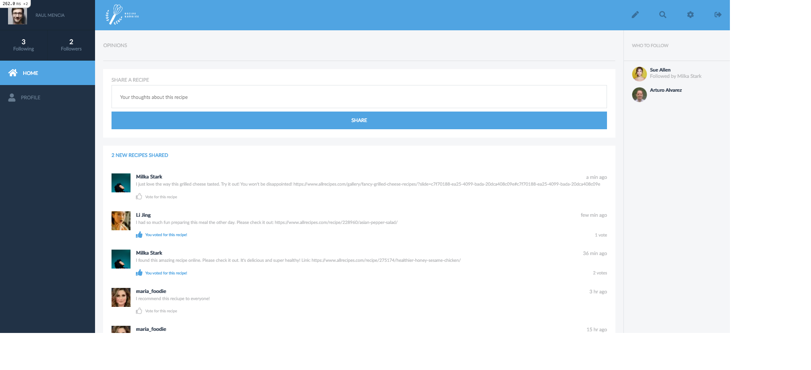
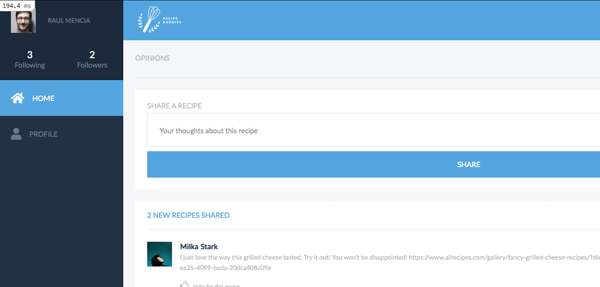
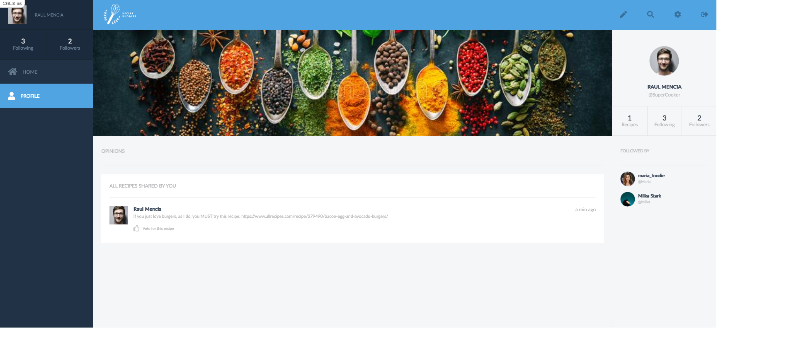
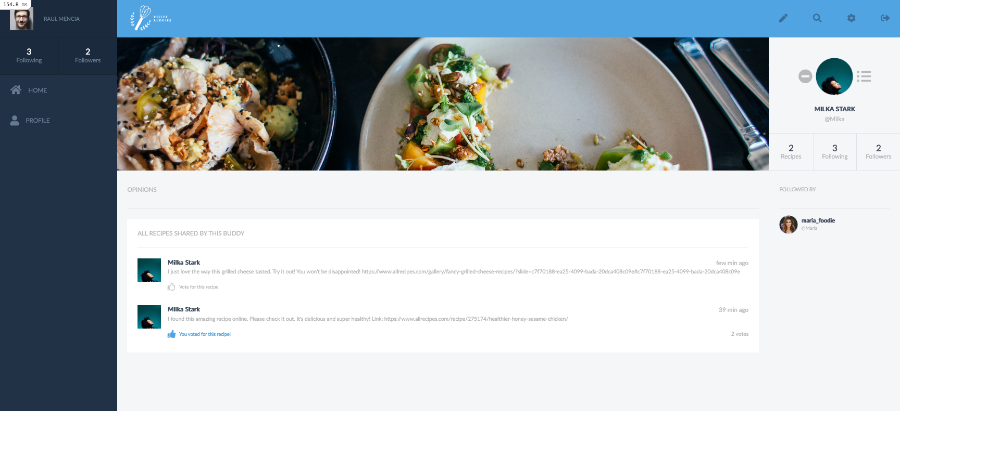
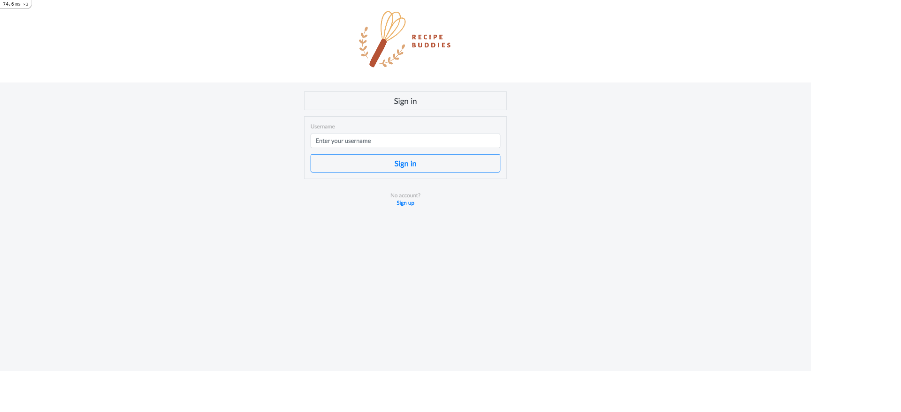
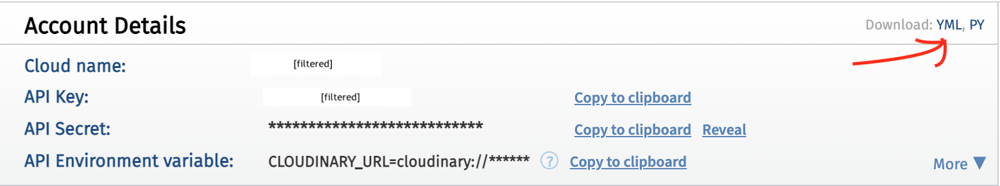

# Recipe Buddies *- a cooking enthusiasts social media platform*

>This is a Rails social media platform for cooking enthusiasts where people can sign up and share their favorite recipes with others. Users can follow each other, write new opinions, or vote for any recipe recommendation they like.

## About

Recipe Buddies is a social media platform built from scratch using Ruby on Rails, Bootstrap, CSS, SCSS, PostgreSQL, and Cloudinary for image cloud storage.

In this platform, users can signup and start sharing opinions on their favorite cooking recipes. Users can follow or unfollow other users (just like in Twitter) and vote or unvote for recipe opinions from other users (including their own).

### Live Demo

**Deployed on: HEROKU**

[Recipe Buddies app](https://gentle-cliffs-69056.herokuapp.com) ⬅️⬅️ Click Here

### Features

- Sign up with a unique username and a full name
- Upload a profile picture and a cover picture
- Follow and unfollow other users
- Share an opinion on a recipe
- Vote for other opinions
- Vote only once per opinion
- See their followers and followed users
- See the number of opinions created since their last logout

### Built with

- Ruby 3.0.1p64 (2021-04-05 revision 0fb782ee38) \[x86_64-darwin17\]
- Rails 6.1.3.1
- PostgreSQL 13.2
- Bootstrap ^4.6.0
- HTML5 / SCSS
- Cloudinary (for image storing)
- Rspec (testing)
- Capybara >= 3.26 (testing)
- Fontawesome
- Mac OS
- VS Code

### App Screenshot
 

#### Homepage

#### Profile page

#### Userpage

#### Login

## Deployment

### Requirements

- Ruby 3.0.1p64
- Rails 6.1.3.1
- PostgreSQL 13.2
- Linux/Mac Operating systems (preferred)

### Setup and Installation

#### Clone / Download Repo
1. Open your terminal or command prompt.
2. If you do not have git installed in your system, skip this step and go to step 3; otherwise, go to the directory where you want to copy the project files and clone it by copying this text into your command prompt/terminal: `git clone https://github.com/StarSheriff2/forms-app.git`.
 Now go to ***"Install Dependencies"*** section
3. Download the program files by clicking on the green button that says “**Code**“ on the upper right side of the project frame.
4. You will see a dropdown menu. Click on “**Download ZIP**“.
5. Go to the directory where you downloaded the **ZIP file** and open it. Extract its contents to any directory you want in your system.

#### Install Dependencies

1. If you are not in your system terminal/command prompt already, please open it and go to the directory where you cloned the remote repository or extracted the project files.
2. While in the project root directory, type `bundle install`. This command will install all the necessary gems in your system.
3. Then you can type <code>yarn install --check-files</code>.

#### Cloudinary Setup
> You will need a Cloudinary account to be able to deploy this app locally. If you already have one, copy your YML file into the config folder; otherwise, create a new account by going to Cloudinary and signing up for a free account: [https://cloudinary.com/](https://cloudinary.com/).

Once you have your new Cloudinary account set up, follow these steps:
1. Login with your new account
2. Go to your Cloudinary dashboard
3. Look for the YML file and click on it to download it

4. Copy this file into your config folder

#### Database Setup

1. Edit the `"database.yml"` file in your `"config"` folder:
    - Change the `username` and `password` under ***`default: &default`*** to your PostgreSQL local credentials or just delete lines 23 and 24 altogether
1. Now, in your terminal, type <code>bin/rails db:create</code> to create your local databases.
2. If successful, type <code>bin/rails db:migrate</code> to migrate the database.

You are all set now!

### Testing

This project uses RSpec and Capybara for all testing. These gems are already in the Gemfile.

**Note:** You will need Chrome to make the integrations tests work, or you can optionally configure Capybara with your preferred browser.

> To run tests go to the root dir of the repo in your terminal and type this: `rspec .`

## Usage
1. In your terminal, run <code>bin/rails server</code> while inside the root directory of the repository files
2. Go to your browser of choice and enter this URL: http://localhost:3000/
3. You can now create a new user, create opinions, follow other users on the platform and vote for any opinion

## Author

👤 **Arturo Alvarez**
- Github: [@StarSheriff2](https://github.com/StarSheriff2)
- Twitter: [@ArturoAlvarezV](https://twitter.com/ArturoAlvarezV)
- Linkedin: [Arturo Alvarez](https://www.linkedin.com/in/arturoalvarezv/)

## 🤝 Contributing

Contributions, issues, and feature requests are welcome!

## Show your support

Give an ⭐️ if you like this project!

## Acknowledgments

Design:
 - Design idea by [Gregoire Vella on Behance](https://www.behance.net/gregoirevella)
 - Licenced under The [Creative Commons license](https://creativecommons.org/licenses/by-nc/4.0/)

Image credits:
- Empty profile picture by <a href="https://pixabay.com/users/wanderercreative-855399/?utm_source=link-attribution&amp;utm_medium=referral&amp;utm_campaign=image&amp;utm_content=973460">Stephanie Edwards</a> from <a href="https://pixabay.com/?utm_source=link-attribution&amp;utm_medium=referral&amp;utm_campaign=image&amp;utm_content=973460">Pixabay</a>
- README pictures downloaded from [Pexels](https://www.pexels.com)

Lato font:
  - Lato is a trademark of tyPoland Lukasz Dziedzic
  - Source URL: http://www.latofonts.com/
  - License URL: http://scripts.sil.org/OFL

## 📝 License

This project is [MIT](https://github.com/StarSheriff2/receipe-buddies/blob/testing/LICENSE) licensed.
